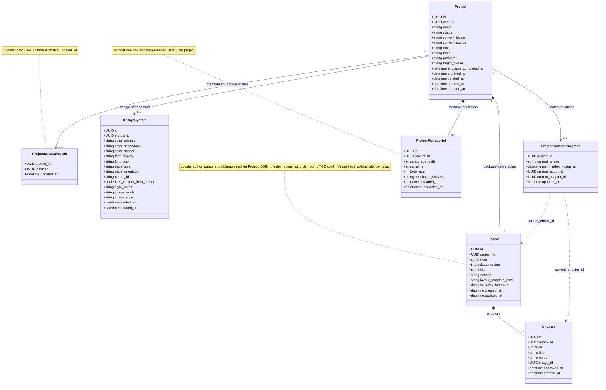
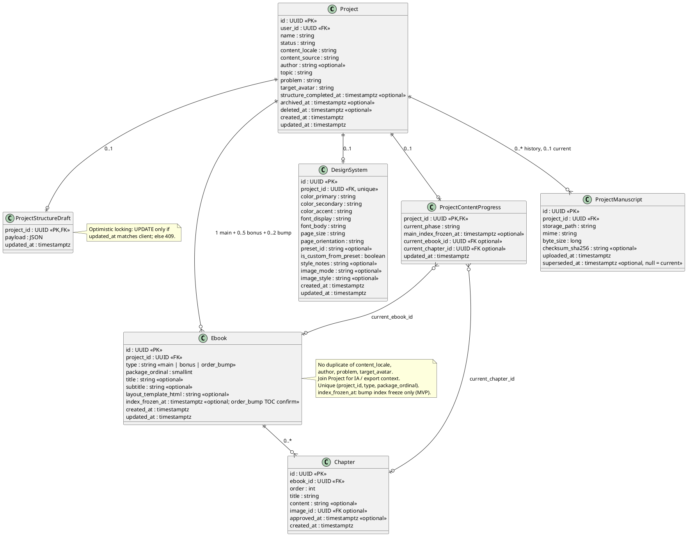

# Project and ebook data model (UML)

Canonical SQL and field notes: [`backend.md`](backend.md) and [`business_logic.md`](business_logic.md).

**Workspace routing:** how `projects.structure_completed_at` and `project_content_progress.current_phase` map to the global Structure / Content / Preview URL segments is defined in [`business_logic.md`](business_logic.md) §9 (not duplicated here).

`content_locale`, `author`, `topic`, `problem`, and `target_avatar` live only on **Project**. **Ebook** rows do not duplicate them; consumers **join** `ebooks.project_id → projects.id` (or load the project once per request).

**`ProjectContentProgress.current_phase`** is restricted in PostgreSQL to: `upload_alignment` | `main_index` | `main_chapter` | `bonus` | `order_bump` | `complete`. Initial phase: **`upload_alignment`** if `content_source = upload`, else **`main_index`**.

**Main ebook TOC:** stored as **`chapters`** on the main ebook (titles + order); **`project_content_progress.main_index_frozen_at`** marks **main** index freeze (not `ebooks.index_frozen_at` on the main row today).

**Order bump TOC:** same persistence pattern as the main ebook — multiple **`chapters`** rows on each **`ebooks`** row with `type = order_bump` (scoped by `package_ordinal`). **`ebooks.index_frozen_at`** on that row marks when the user **confirmed** that bump’s index in Content.

**Bonus ebooks:** usually **one** chapter row for the single-section deliverable.

**`chapters.approved_at`** applies to **body** approval per chapter, not TOC confirmation, for all types above.

**`chapters.content` (body):** persisted as **rich HTML** (fragment), not Markdown. The Content wizard uses **Tiptap** for editing and **DOMPurify** on the client to sanitize to an allowed tag subset before `UPDATE`; AI stubs and future LLM output should return compatible HTML fragments.

**Contenido chat:** **`content_chat_threads`** — `chapter_id` set = one thread per **chapter / bonus / bump** artifact in MVP. **`chapter_id` null** slot (historically “main index / TOC” chat): **post-MVP** if conversational index refinement is enabled; **MVP** uses explicit generate/regenerate outline actions **without** an index chat transcript. Messages in **`content_chat_messages`**. **MVP:** persist **`user`** server-side with `client_message_id` idempotency (unique per thread) and persist **`assistant`** only when the streamed reply **finishes** (no per-chunk rows).

---

## Mermaid (class diagram)

Renders in GitHub, GitLab, and many Markdown previews.

---

## PlantUML (class diagram)

Use in IDE plugins, [plantuml.com](https://www.plantuml.com/plantuml), or CI renderers.

